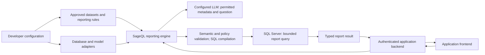

# SageQL: an embedded reporting SDK

Architecture and implementation path, 2026-10-05. The first embedded SDK slice is now implemented in `sageql.sdk`: trusted catalog/policy configuration, sessions, deterministic single-source SQL Server execution, typed report JSON, and a reference frontend. See the [implemented API guide](SDK.md) and [adapter scope](SDK_SQL_SERVER.md) for the actual contracts. Broader capabilities and illustrative APIs below remain design targets. This work does not expand the Rahtal executor or define the historical Step 5.

## Product outcome

A developer installs SageQL in a Python backend, registers the SQL Server data and business rules that their application exposes, supplies database and model infrastructure, and connects their frontend to their own authenticated backend. An end user asks for reports, answers material clarification questions, receives a table or chart, and can refine that report in the same conversation.

SQL Server is the first production database target. Rahtal is a real-data integration test, not the product's permanent table allowlist. SQLite remains a useful offline reference adapter. Frontends can use any framework; other backend languages can call a Python service later.

Success is a developer embedding the package in a separate application and a user obtaining correct, authorized reports through that application's chat. CLI stage output and syntactically valid SQL alone do not meet that outcome.

## What the current project provides

| Existing component | Reuse | Product gap |
| --- | --- | --- |
| `catalog_input.py`, `schema.py`, `discovery.py` | Supplied catalogs, bounded model metadata, verified selected IDs | Typed business metrics, dataset grain, cardinality, per-user visibility |
| `understanding.py`, `context.py` | Clarification and successful-turn history | Serializable sessions and report refinement after a ready request |
| `planning.py` | Typed logical operations and strict reference checks | Approved metric formulas and deterministic semantic validation |
| `sql_generation.py`, `report_validation.py`, `execution.py` | Reference rendering, exact query agreement, SQLite read limits | Common adapter contract and trusted policy compilation |
| `tsql.py`, `sageql_rahtal/` | T-SQL rendering, revalidation, soft-delete rules, bounded results | Reviewed SQL Server adapter for developer-configured datasets |
| `chat_cli.py`, `main.py` | Debugging and offline examples | A single embeddable orchestration API |
| `QueryResult`, `TSQLResult` | Result rows and truncation | Typed report payloads, useful labels, units, provenance, presentation |

Keep the validated logical plan and deterministic SQL path. Evolve the public orchestration and contracts around it. The experimental model-written SQL proposal API remains outside the reporting engine.

A synthetic check during this assessment exposed an important limit: one order with amount `100`, joined to two item rows, produced `SUM(orders.amount) = 200` while `validate_report_query` returned `valid=True`. Join cardinality appeared only as a review item. This is evidence for adding enforced grain/cardinality rules before automatic reports, not a claim that SQL syntax validation can prove business correctness.

## Deployment and responsibilities



The host application owns authentication, identity, deployment, secrets, retention settings, and HTTP endpoints. SageQL owns report interpretation, session transitions, validated query specifications, policy compilation, database adapter behavior, and typed report output. The frontend owns rendering and user interaction.

The browser sends a message and identifiers. It cannot supply credentials, connection strings, SQL, database paths, tenant identity, policy definitions, or an unrestricted catalog. Dataset IDs must resolve through a server-side registry and the caller's permitted scope. Configuration happens at application startup or through a separate trusted administration interface.

Start with one Python package and internal modules. No separate microservices, vector database, autonomous multi-agent runtime, or mandatory web framework is needed for the initial product. A small reference web application demonstrates integration; a reusable frontend widget can follow a stable JSON contract.

## Developer configuration

Expose a versioned `ReportingCatalog` that wraps the physical schema and adds executable reporting meaning. Keep the existing JSON catalog supported through an explicit conversion path.

| Configuration | Minimum contract |
| --- | --- |
| Infrastructure | Explicit SQL Server dialect, connection factory and lifecycle, configured provider, model timeout, query budgets, optional session store |
| Dataset | Stable ID, approved table or view, row grain and key, display names, permitted columns and operations |
| Relationships | Exact key pairs, direction, declared cardinality, approved join behavior, tenant compatibility |
| Metrics | Stable ID, label, aggregate or validated expression tree, source grain, unit, precision, null and zero rules |
| Dimensions and filters | Stable IDs, labels, typed operators, developer-supplied value mappings where needed |
| Time | Date/timestamp column, storage timezone, business timezone, calendar, week start, approved grains |
| Access | Trusted policy callback, public versus compiler-only columns, permitted datasets, optional aggregate restrictions |

Example: `activity_hours` means `sum(activities.time)` and has unit `hours`; `employee` is an approved dimension; active-record and authenticated tenant restrictions are trusted policies. A user can ask to group that metric by day or employee without redefining its formula.

Different reports come from supported combinations of registered metrics, dimensions, periods, filters, sorting, and presentation. An approved hours metric can support daily totals, totals by employee, and monthly trends. A requested calculation outside that vocabulary produces a clarification or unsupported outcome; model creativity does not silently expand the data or calculation contract.

For easy onboarding, developers can register simple counts and numeric aggregates directly. Explicit metric definitions are required when business meaning is ambiguous or the calculation spans datasets. Prepared reporting views are a useful first integration path when application tables have complex relationships. Formula configuration uses a small typed expression tree; arbitrary SQL fragments do not become the model's execution interface.

Metadata verification checks only registered objects and confirms required columns/types/keys before execution. It never turns unregistered live objects into permitted reporting data. A catalog version identifies the reporting contract; schema drift or an unverifiable relationship fails with a developer-facing diagnostic.

## From conversation to query

Use a structured `ReportSpec` containing metric IDs, dimension IDs, typed user filters, time selection, comparison selection, ordering, limit, and presentation preference. Preserve the user's phrases alongside resolved IDs for explanations. This separates business interpretation from physical SQL planning.

1. Authorize the request and obtain a permitted catalog using the trusted actor supplied by the host.
2. Interpret the message as a new report, clarification answer, or refinement of the current report revision.
3. Resolve only against permitted metrics, dimensions, relationships, and operations. Ask a focused question when several meaningful interpretations remain; return `unsupported` when the configured data cannot answer it.
4. Resolve time with a supplied clock, business timezone, and calendar. Record exact inclusive start and exclusive end boundaries. Preserve date-only fields as business dates; timestamp filtering and grouping must both honor the configured storage/report timezone mapping. Ambiguous date formats and unavailable calendar rules require clarification.
5. Validate the complete report specification, metric grain, and join cardinality. Build a logical plan from trusted definitions.
6. Apply mandatory access and dataset policies deterministically. The model cannot add, remove, or supply their values.
7. Compile parameterized T-SQL, revalidate the plan, policies, SQL, parameters, and current authorization, then execute only under the configured execution mode.
8. Serialize results and construct a report whose labels and numbers come from the specification and result data.

The current understanding, context, discovery, and proposal calls can implement the first orchestrator. Keep model calls bounded; later combine stages or skip unnecessary selection calls when evaluations show that accuracy is preserved. Clarification is an intentional state transition, not a failed request.

SQL validation establishes agreement with the approved specification and policies; it cannot establish an unstated business meaning. Material ambiguity blocks automatic execution. Business rules supplied and reviewed by the developer allow routine reports to run without repeatedly asking users to review SQL. Existing APIs keep their current execution defaults during migration.

## Authorization and execution

Read-only SQL prevents modification; it does not decide whose rows a user may see. A host-supplied `ActorContext` and policy callback must determine access on every turn, execution, saved-report read, and export. A missing required actor attribute fails closed. User message text and request JSON are never identity evidence.

User filters and trusted policies are separate fields. `RequiredFilter` currently checks whether a filter already exists in the logical plan; it is not a policy injector. Introduce a deterministic policy application layer and validate its output. Apply restrictions to every relevant table and comparison branch, with join placement that preserves intended outer-join semantics. Include tenant compatibility in joins where identifiers are only unique within a tenant.

Columns required for policy enforcement or joins can remain compiler-only. They need not become selectable fields, model-visible data, or result columns. Restrict denied columns across filtering, sorting, grouping, and aggregation too. Aggregate-only datasets need explicit rules for drill-down and small groups before they are exposed.

The generic SQL Server adapter requires its own implementation and review:

- Explicit supported types, aggregates, grains, functions, identifiers, and binding rules; no dialect inference from an ODBC driver name.
- Canonical rendering and exact validation of the compiled plan plus policies, including parameters in SQL placeholder order.
- Developer-provided connection factory with documented ownership, cleanup, rollback, and pool behavior. Use a dedicated least-privilege reporting credential or reporting views for deployments; do not reintroduce a blanket refusal based only on the login having write permissions.
- Parameter type handling for decimals, dates, timestamps, Unicode, booleans, and nulls. Preserve decimal precision in results and the JSON contract.
- Database-side result bounds where possible, fetch bounds, command timeout, connection timeout, cancellation, total request deadline, and concurrency budgets. A row limit alone does not bound aggregation work.
- Registered-schema verification and schema/version checks before execution. Reject unsupported query shapes instead of silently adapting them.
- Sanitized public errors. No credentials, row values, or private schema in default diagnostics. Real-data fixtures and pilot reports stay ignored and local.

Database-native row security can complement compiler policies where the host uses it. If identity is carried through SQL Server session context, initialize and verify it for every connection checkout, and prevent identity leakage through connection reuse. Support this only with explicit adapter tests and documented lifecycle behavior.

SQLite's existing authorizer remains a reference for table/column/action enforcement, not a substitute for row policies. SQL Server row-level security enforces row predicates in the database. These mechanisms support the proposed layers but do not remove the host's responsibility to authorize session and report access. See [SQLite authorizer documentation](https://www.sqlite.org/c3ref/set_authorizer.html), [SQL Server row-level security](https://learn.microsoft.com/en-us/sql/relational-databases/security/row-level-security?view=sql-server-ver17), and [OWASP authorization guidance](https://cheatsheetseries.owasp.org/cheatsheets/Authorization_Cheat_Sheet.html).

## SDK and frontend contract

The proposed public facade is `SageQL`, configured once with catalog, provider, adapter, policy, clock, limits, and session store. Its initial operations are `create_session`, `submit`, and `get_report`. Async variants should be explicit and share the same state contract; do not run blocking ODBC work on a web event loop.

Conceptual usage only; these names are not available in today's package:

```python
# Application startup: trusted infrastructure and definitions.
engine = SageQL(
    catalog=reporting_catalog,
    database=sql_server_adapter,
    provider=configured_provider,
    policy=application_report_policy,
    sessions=application_session_store,
    clock=application_clock,
    execution="validated",  # Explicit developer opt-in.
)

# Inside a host endpoint, after the host authenticates the caller.
reply = engine.submit(
    session_id=authorized_session_id,
    message=request.message,
    actor=host_authenticated_actor,
    request_id=request.request_id,
    expected_revision=request.expected_revision,
)
return reply.to_dict()
```

Session ownership, dataset access, and policy are checked by the engine as well as endpoint routing. Calls return a typed reply with one of `needs_clarification`, `report_ready`, `unsupported`, `blocked`, or `failed`. Running work can expose `working` progress through an optional event interface. Use stable machine-readable error codes and safe messages; diagnostic details remain in a restricted host channel.

A session records owner identity, dataset/catalog version, revision, successful messages, pending clarification, resolved specification, and report references. Do not store credentials, connection handles, or provider clients. Provide an in-memory store for examples and a store protocol for applications. Persisted content requires host-defined retention and access rules.

Serialize mutations per session or use revision checks. Idempotent request IDs prevent duplicate execution on browser retries. Follow-ups such as "now group it by employee" create a new report revision from the prior specification; they do not reuse a completed understanding session that rejects new turns. Changed authorization is rechecked before any result reuse. Cancellation and timeout leave a retryable state without a partial report labeled complete.

Retain the previous successful report until a revised specification executes successfully. Restoring a persisted session after a host restart must preserve its pending question and successful report revision. A session serialization round trip must not require deserializing executable Python objects.

Suggested host routes are `POST /report-sessions`, `POST /report-sessions/{id}/messages`, and `GET /reports/{id}`. They are example integration routes, not a mandatory embedded server. An event stream can later deliver progress and a completed report; start with a bounded request/response implementation.

## Report output

A versioned `ReportArtifact` contains report/session IDs, revision, title, a plain-language description of the calculation, typed columns with labels/units, bounded rows, the effective period and filters, generation time, catalog/policy versions, truncation, and optional validated chart configuration. Backend SQL and private policy details remain developer diagnostics.

For example, a reply can have this shape with synthetic values; the final schema needs complete field and error definitions before implementation:

```json
{
  "contract_version": 1,
  "session_id": "session-example",
  "revision": 2,
  "status": "report_ready",
  "assistant": {"text": "Daily activity hours for September 2026."},
  "clarification": null,
  "report": {
    "id": "report-example",
    "title": "Daily activity hours",
    "fields": [
      {"id": "day", "label": "Day", "type": "date"},
      {"id": "hours", "label": "Activity hours", "type": "decimal", "unit": "hours"}
    ],
    "rows": [["2026-09-01", "12.50"]],
    "visualization": {"kind": "line", "x": "day", "y": "hours"},
    "provenance": {
      "period_start": "2026-09-01",
      "period_end_exclusive": "2026-10-01",
      "metric_id": "activity_hours"
    },
    "truncated": false
  },
  "error": null
}
```

Decimal values are serialized losslessly as strings with a declared type; dates use documented ISO representations. Unsupported binary or driver-specific values produce an explicit serialization error rather than an accidental string representation.

Tables are the first supported presentation. Add line charts for time series, bars for categories, and scalar metric cards through a small declarative chart schema referencing returned columns. Do not accept arbitrary model-written HTML, JavaScript, or executable chart code. Escape user/model labels and validate chart references and supported options.

The initial description can be generated from approved definitions and actual values without another model call. Result rows stay local to the host by default. Sending rows to an LLM for richer narrative is a separate developer-controlled data-sharing choice, not an automatic extension of metadata sharing.

Mark empty data as no matching data, not automatically zero. Mark truncated results and do not present totals from a partial result as full totals. Comparisons require defined bucket alignment, partial-period rules, missing-period behavior, and zero-baseline behavior; the current labeled `UNION ALL` rows alone are not a completed comparison report. Export authorization must be the same as report access; CSV/spreadsheet export also requires safe cell serialization.

## Implementation sequence and acceptance gates

### Milestone A: one SDK contract

Add the facade, reply/report schemas, explicit session state, and store protocol around the existing components. Specify policy and adapter interfaces before generalizing execution. Use fake providers and adapters to verify the contract.

Acceptance: separate sessions cannot share history; a pending clarification resumes correctly; a completed report accepts a refinement; duplicate requests do not execute twice; revision conflicts have a stable result; core orchestration never calls terminal input, prints results, or reads `.env` implicitly. Pending clarification and completed-report state survive serialization and host restart. Provider or execution failure preserves the prior successful report. Existing low-level APIs and offline tests still work.

### Milestone B: one correct, authorized SQL Server report

Implement a reviewed adapter for a developer-registered dataset and one explicit metric, time dimension, and trusted row policy. Start with one table or a reporting view and supported simple aggregates. Add typed semantic definitions and date resolution needed for that slice. This is the first execution expansion beyond the current pilot and must land with its own scope, tests, and safety design.

Acceptance: a separate example application installs the built wheel and returns the expected SQL Server totals; unregistered columns and malicious model output fail before the report query is sent; two trusted users receive their respective scopes; policy removal requests have no effect; missing identity blocks execution; time bounds are reproducible; timeout and cancellation close resources; decimals survive serialization. Ordinary unit tests use fake providers/adapters and require neither credentials nor a running SQL Server. Run a separate integration suite against seeded synthetic SQL Server data. Then test equivalent supported shapes with Rahtal locally, comparing results to a human-reviewed reference query, without sending returned rows to the model.

### Milestone C: a complete frontend conversation

Add a reference host application and minimal chat with report tables, one chart, clarification, retries, and report refinement. The host supplies authentication and configuration once. End users interact only with business questions and report results. Use a developer-provided reporting view for the employee dimension until the relationship expansion in Milestone D.

Acceptance scenario: "Show daily activity hours for September" asks for the year if needed, returns an authorized report, and "group it by employee instead" changes that report while retaining the resolved period and metric. A denied employee field has a safe outcome. New questions can create new report revisions in the same session. There are no database/model setup prompts in the end-user flow.

### Milestone D: broader reports with measured correctness

Add approved many-to-one relationships, multiple metrics, sorting and top-N, then comparisons and exports in separate slices. Reject or require developer-supplied reporting views for unknown/many-to-many fan-out until a tested grain-preserving compilation strategy exists. Add fiscal or Persian calendar behavior only as an explicit configured feature.

Acceptance: golden result datasets cover duplicate child rows, absent profiles, cross-tenant keys, nulls, empty periods, date boundaries, different units, comparison zeros, and partial periods. Tests compare correct rows and totals, not only SQL text. Maintain a corpus of realistic English and any intended additional-language questions, expected interpretations, necessary clarifications, and expected outcomes. Optional live-provider evaluations measure accuracy, clarification rate, latency, and model usage separately from offline unit tests.

## Migration and release criteria

Keep current APIs operational while adding the facade. Have the CLI consume the facade once equivalent behavior is covered. Isolate provider transport, request interpretation, semantic planning, policy compilation, SQL Server adapter, sessions, and report formatting into internal modules; do not export every implementation detail as a permanent public API.

Rahtal should become a host configuration and integration example after the generic adapter covers its approved behavior. Keep pilot-specific repairs out of generic business logic. Do not move secrets, production rows, or ignored reports into packaged examples.

Release the initial embedded product only after installation into a separate host project, SQL Server integration, session isolation, policy enforcement, report result correctness, bounded failures, and a frontend clarification/refinement conversation are demonstrated. Preserve offline tests and packaging checks; document the supported query shapes and limitations. Add capabilities only with their own acceptance cases.
